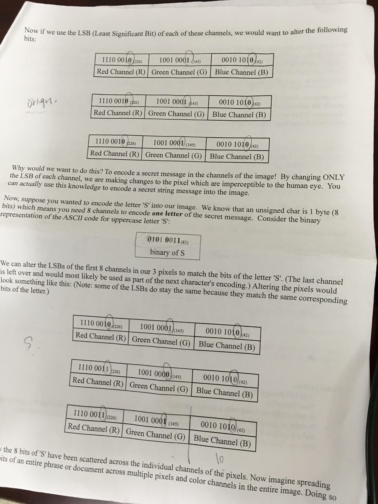

# A Bit of Spycraft project
## Project goal: Hide message inside .ppm image and Recover it.
## Project process?
1 Step create PPMImage class
2 Step write Main for user prompt 
3 Step Read/Write image file
4 Step Use Bit manipulation to handle image-message
### How to hide and recover secret message
String message consists of several chars. each char is 1 byte(8bit). Use 8channels to encode one letter. Check Least Significant bit, then alter last bit.  

#### PPM File Format
Digital images are represented as a sequence of elements known as pixel. The pixels are arranged in a series of <bold>Rows</bold> and <bold>Columns </bold>. PPM images has following format(such as): line by line  
P6LF (magic number should be P6; LE or /n should be spaces or line feed characters NOT carriage returns)  
366 573LF (width of image, empty space, height of image, /n)  
255LF (maximum color value in ASCII decimal, must be less than 65536 and more than 0, always be 255)  
Huge Pixel DATA (A raster of height rows, in order from top to bottom. Each row consists of width pixels, in order from left to right. Each pixel is a triplet of RGB, and blue channels, in that order. Each channel is represented in pure binary by either 1 or 2 bytes. if MAXcolor < 256, it is 1 byte. Otherwise is 2 byte).  
#### How to see data in ppm
Use notepad++ or Visual Studio see data or download Irfan View (Ubuntu cannot open this software)
